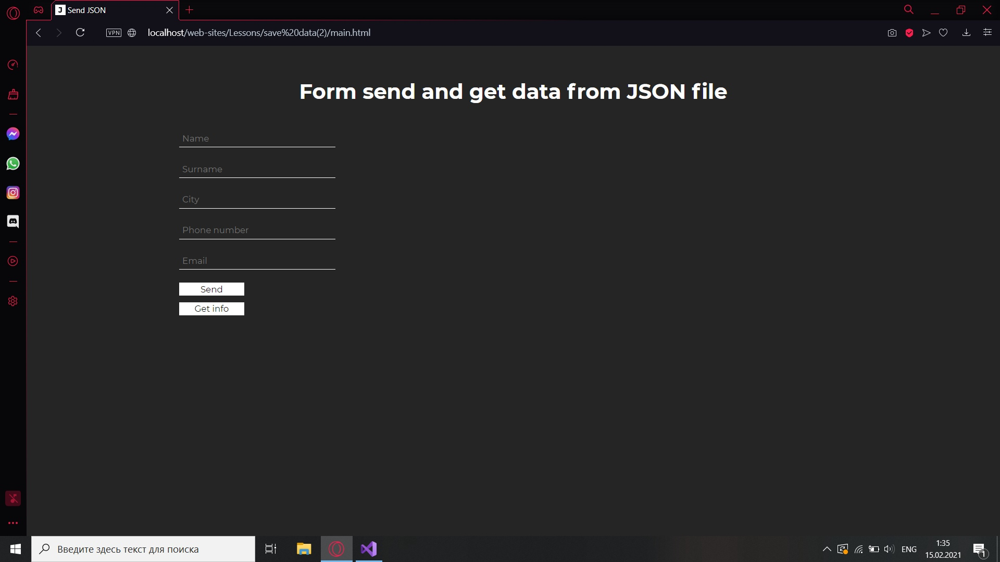
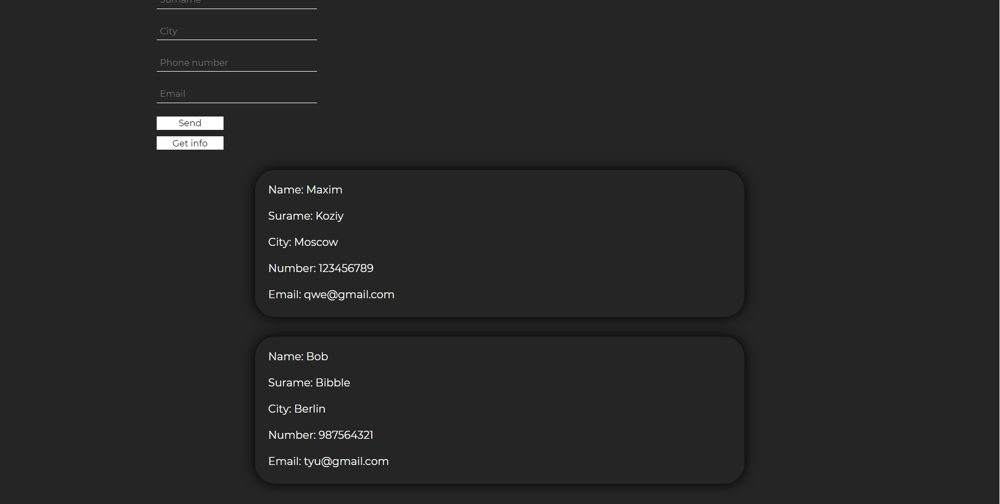

# Form for send and get data from JSON file

The project teaches how to: 
- Send network requests to the server
- Upload new information as needed

### Network requests JS

```javascript
try {
        let response = await fetch("./php/add_user.php", {
            method: "POST",
            headers: {
                'Content-Type': 'application/json;charset=utf-8'
            },
            body: JSON.stringify(user)
        });

        let result = await response.json();
        
    } catch (error) {
        console.log(error);
    }
```

### Network requests PHP

```php
header("Content-Type: application/json");
    
    $data = json_decode(file_get_contents("php://input"));
    $filename = 'data.json';

    if (file_exists($filename)) {
        $file = file_get_contents('data.json');

    } else {
        $file = fopen("data.json", "a+");
    }

    $taskList = json_decode($file, true);
    $taskList[] = array($data);

    file_put_contents('data.json', json_encode($taskList));

    $file = file_get_contents('data.json');

    unset($file);
    unset($taskList);
```

#### How form looks in the first:  



#### And after receiving the information:



For looking the work you should open file "main.html"
Or Just go to the link for watch the video -   
how it works: https://youtu.be/L0blh3ybYOw


